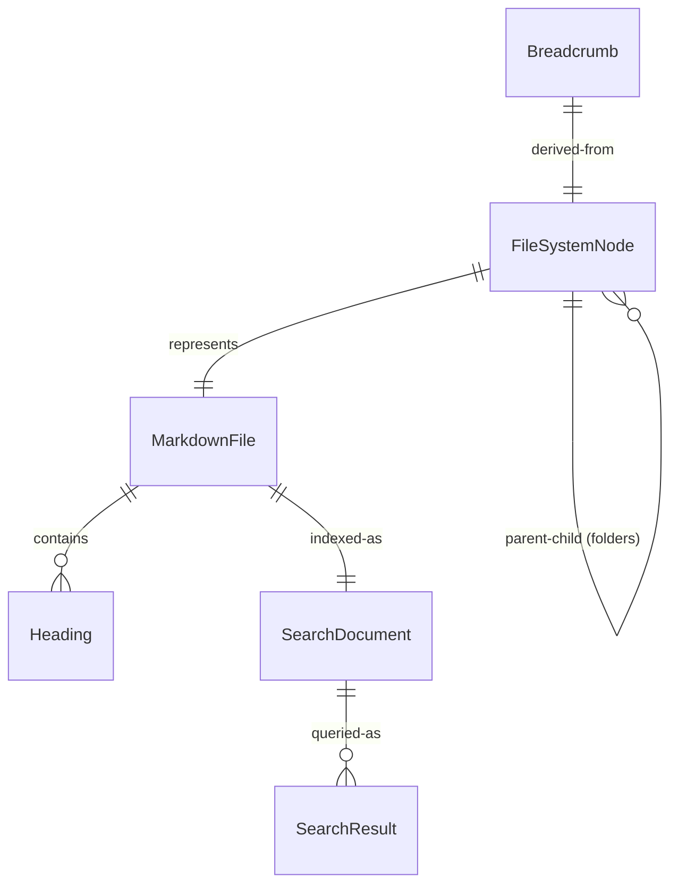

# Data Model: Documentation Website

**Feature**: Documentation Website (001-doc-site)
**Date**: 2026-01-14
**Purpose**: Define entities and their relationships for the documentation site

## Overview

This data model represents the in-memory structures used during the build process and runtime of the static documentation site. No database is used - all data is derived from the filesystem.

---

## Entities

### 1. FileSystemNode

Represents a file or folder in the repository.

**Purpose**: Unified abstraction for files and folders in the navigation tree

**Fields**:
| Field | Type | Description | Validation |
|-------|------|-------------|------------|
| `name` | string | Base filename/foldername | Required, non-empty |
| `path` | string | Full relative path from repository root | Required, uses forward slashes |
| `type` | enum | Either `"file"` or `"folder"` | Required |
| `extension` | string \| null | File extension including dot (e.g., ".md") | Required for files, null for folders |
| `children` | FileSystemNode[] \| null | Array of child nodes | Required for folders, null for files |

**State Transitions**: None (immutable after scanning)

---

### 2. MarkdownFile

Represents a parsed markdown file with metadata.

**Purpose**: Holds raw content and parsed metadata for rendering

**Fields**:
| Field | Type | Description | Validation |
|-------|------|-------------|------------|
| `path` | string | Relative path to file | Required, unique |
| `name` | string | Filename without extension | Required |
| `content` | string | Raw markdown content | Required |
| `title` | string | Extracted or inferred title | Defaults to first heading or filename |
| `headings` | Heading[] | Extracted heading hierarchy | Built during parsing |
| `frontmatter` | object | YAML frontmatter if present | Optional, null if none |
| `wordCount` | number | Total words in content | Computed |

**State Transitions**:
1. `Raw` → `Parsed` (after markdown parsing)

---

### 3. Heading

Represents a heading within a markdown document.

**Purpose**: Enable table of contents generation and anchor linking

**Fields**:
| Field | Type | Description | Validation |
|-------|------|-------------|------------|
| `level` | number | Heading depth (1-6) | Required, 1-6 |
| `text` | string | Heading text content | Required |
| `id` | string | URL-safe anchor ID | Auto-generated from text |
| `children` | Heading[] | Child headings (deeper level) | Optional |

**State Transitions**: None (derived from content)

---

### 4. SearchDocument

Represents a file in the search index.

**Purpose**: Optimized structure for fast full-text search

**Fields**:
| Field | Type | Description | Validation |
|-------|------|-------------|------------|
| `id` | string | Unique identifier (file path) | Required |
| `title` | string | Document title | Required |
| `content` | string | Plain text content (markdown stripped) | Required |
| `path` | string | File path for navigation | Required |
| `headings` | string[] | All headings for context | Optional |

**State Transitions**:
1. `Indexed` → `Queried` (search operation)

---

### 5. SearchResult

Represents a single search result.

**Purpose**: Display search results with relevance context

**Fields**:
| Field | Type | Description | Validation |
|-------|------|-------------|------------|
| `document` | SearchDocument | Reference to indexed document | Required |
| `score` | number | Relevance score | Higher = more relevant |
| `snippet` | string | Highlighted matching text | Optional |

**State Transitions**: None (query result)

---

### 6. Breadcrumb

Represents a navigation breadcrumb.

**Purpose**: Show current location and enable navigation to parent directories

**Fields**:
| Field | Type | Description | Validation |
|-------|------|-------------|------------|
| `label` | string | Display name (folder/file name) | Required |
| `path` | string | Relative path to this location | Required |
| `isCurrent` | boolean | Whether this is the current page | Required |

---

## Relationships

**Relationship Rules**:
1. A `FileSystemNode` of type `folder` has zero or more `children`
2. A `FileSystemNode` of type `file` maps to exactly one `MarkdownFile`
3. A `MarkdownFile` has zero or more `Heading` entities
4. A `MarkdownFile` maps to exactly one `SearchDocument`
5. A `SearchDocument` produces zero or more `SearchResult` entities when queried
6. `Breadcrumb` is a derived view of `FileSystemNode` path traversal

---

## Data Flow

### Build Phase

### Runtime Phase

---

## Validation Rules

### FileSystemNode
- `name` must not contain path separators (/ or \)
- `path` must use forward slashes consistently
- Folder `children` arrays are sorted alphabetically

### MarkdownFile
- `path` must end in `.md`
- `title` defaults to first `h1` text, or filename if no `h1`
- `wordCount` excludes code blocks from counting

### SearchDocument
- `content` has markdown syntax stripped (links, images, code blocks converted to plain text)
- `headings` array includes all heading levels flattened

---

## Performance Considerations

**Memory**:
- FileSystemNode tree for 1,000 files: ~100KB
- Search index for 1,000 files: ~2-5MB (compressed)
- All MarkdownFile objects in memory during build only

**Build Time**:
- Filesystem scan: O(n) where n = total files
- Markdown parsing: O(m) where m = total markdown content size
- Search indexing: O(total words)

**Query Time**:
- FlexSearch: O(log n) per query, typical <100ms for 1,000 documents

---

## Edge Cases Handled

| Scenario | Handling |
|----------|----------|
| Empty file | `MarkdownFile.content` = empty string, `wordCount` = 0 |
| Folder with no markdown | Excluded from search index, shown in navigation |
| Special characters in filename | URL-encoded in `id`, preserved in `name` |
| Broken internal links | Preserved as-is, link validation is out of scope |
| Very large file (>1MB) | Parsed normally, pagination is frontend concern |
| Non-.md extensions | Filtered out during `MarkdownFile` creation |
